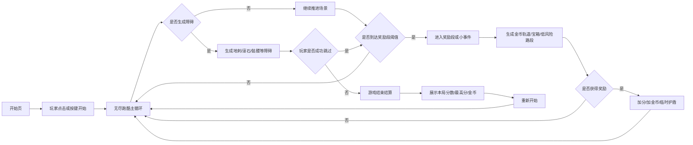

# 方案：本地离线地下城跳跃跑酷游戏

**生成时间**：2026-06-11
**预计复杂度**：中

## 概述

本方案以 Google Chrome 断网小恐龙为核心参考，保留“角色自动前进、玩家单键跳跃躲避障碍”的低门槛玩法，同时将视觉主题和轻度玩法增强改造成地下城风格。首版目标是做出一个可在本地直接打开运行、同时兼容 PC 键盘与手机触控的 H5 小游戏。

首版采用 `原生 HTML/CSS/JS` 技术路线，优先使用 `DOM + CSS transform + requestAnimationFrame` 实现，以降低本地部署门槛并保持调试直观性。玩法上使用“无尽主循环 + 周期性奖励段”的混合模式，增强地牢冒险感，但不引入复杂战斗、地图探索或多按键操作。

## 已确认需求

- 核心玩法参考 Chrome 小恐龙：自动前进，玩家主要执行跳跃操作。
- 主题改为地下城风格，而不是沙漠或现代场景。
- 采用轻度玩法升级，而不是纯换皮或重关卡化。
- 支持双端输入：PC 键盘与手机触控都可玩。
- 节奏为混合模式：无尽主循环中定期插入奖励段或小事件。
- 技术路线为原生 `HTML/CSS/JS`，本地直接打开即可运行。
- 首版就规划简易像素风资源，不走纯占位块方案。

## 默认假设

- 首版为单人离线本地游戏，不接入网络、账号、排行榜服务。
- 首版不依赖构建工具，不要求 npm、打包器或本地服务器。
- 首版以横屏视觉为主，但在手机竖屏下仍需保证主体跑道与交互可用。
- 首版默认不开启复杂音效系统，音频作为可选增强项后置。

## 目标态流程图



## 前置条件

- 具备一个空白本地项目目录。
- 可新增 `index.html`、`styles/`、`scripts/`、`assets/`、`docs/` 目录结构。
- 准备简易像素风资源，或先使用等尺寸自制占位图逐步替换。
- 浏览器支持 `requestAnimationFrame`、`localStorage`、`pointer/touch` 事件。

## Sprint 1：最小可玩版本

**目标**：完成本地可直接打开运行的基础跑酷游戏，具备开始、跳跃、障碍、碰撞、结算的闭环。

**Demo / 验证**：

- 双击打开 `index.html` 后可以进入开始页并启动游戏。
- PC 可使用 `Space / ArrowUp` 跳跃，手机可点击屏幕跳跃。
- 碰撞障碍后触发结算层，并可重新开始。

### 任务 1.1：初始化页面骨架与资源目录

- **位置**：`index.html`、`styles/main.css`、`scripts/`、`assets/`
- **描述**：创建单页游戏骨架，预留开始层、游戏视口、结算层与 UI 层；建立样式、脚本、资源目录。
- **依赖**：无
- **验收标准**：
  - 页面可直接本地打开且无资源路径错误。
  - 存在清晰的游戏容器与叠层结构。
- **验证方式**：
  - 浏览器打开页面检查 DOM 结构和基础样式是否加载。

### 任务 1.2：实现游戏主循环与基础状态机

- **位置**：`scripts/game.js`、`scripts/config.js`
- **描述**：实现 `ready`、`running`、`gameOver` 三态，接入 `requestAnimationFrame` 驱动刷新、速度推进、重开逻辑。
- **依赖**：任务 1.1
- **验收标准**：
  - 游戏状态切换稳定，无重复启动或无法重开问题。
  - 主循环可按帧更新对象位置与 UI。
- **验证方式**：
  - 连续多次开始、结束、重开，确认状态不紊乱。

### 任务 1.3：实现骑士角色与跳跃物理

- **位置**：`scripts/player.js`、`styles/main.css`、`assets/sprites/`
- **描述**：实现骑士跑步、起跳、下落、落地四个基础状态；使用简单重力与速度模拟可控跳跃曲线。
- **依赖**：任务 1.2
- **验收标准**：
  - 玩家输入只触发一次跳跃，不出现连跳穿模。
  - 落地后可继续下一次起跳。
- **验证方式**：
  - 连续短按、长时间测试，观察跳跃节奏与落地恢复。

### 任务 1.4：统一双端输入层

- **位置**：`scripts/input.js`
- **描述**：封装键盘与触控输入，将 `Space`、`ArrowUp`、`pointerdown/touchstart` 统一映射为跳跃动作。
- **依赖**：任务 1.3
- **验收标准**：
  - 键盘与触控输入共用同一业务入口。
  - 手机端点击空白区域即可跳跃。
- **验证方式**：
  - PC 浏览器键盘测试；移动端模拟器或真机点击测试。

### 任务 1.5：实现基础障碍生成与碰撞检测

- **位置**：`scripts/obstacles.js`、`scripts/game.js`
- **描述**：首版先接入 2-3 种障碍，如地刺、滚石、骷髅；实现随机生成、左移回收、AABB 基础碰撞盒检测。
- **依赖**：任务 1.2、任务 1.3
- **验收标准**：
  - 障碍会按规则进入画面并随速度推进。
  - 碰撞必定结束游戏，未碰撞不会误判。
- **验证方式**：
  - 多轮运行观察障碍生成节奏并人工测试擦边场景。

### 任务 1.6：实现开始页、分数与结算页

- **位置**：`scripts/ui.js`、`styles/main.css`
- **描述**：实现开始提示、当前分数、最高分、结算重开提示，并用 `localStorage` 保存历史最高分。
- **依赖**：任务 1.2、任务 1.5
- **验收标准**：
  - 游戏开始前和结束后有明确引导。
  - 历史最高分在刷新页面后仍保留。
- **验证方式**：
  - 手动刷新页面并验证最高分持久化。

## Sprint 2：地下城主题与轻度增强玩法

**目标**：将最小闭环升级为“有辨识度的地下城跑酷”，加入奖励段、金币、宝箱和节奏变化。

**Demo / 验证**：

- 可明显感知地下城氛围，不再是普通占位跑酷。
- 奖励段会周期性出现，玩家能获得金币与额外加成。
- 游戏节奏存在张弛，而不是只有线性加速。

### 任务 2.1：制作地下城视觉皮肤

- **位置**：`assets/sprites/`、`assets/backgrounds/`、`styles/main.css`
- **描述**：补齐骑士、尖刺、滚石、骷髅、金币、宝箱、火把、石砖地面、远景墙体等像素风资源，并统一尺寸与色板。
- **依赖**：Sprint 1 完成
- **验收标准**：
  - 核心实体视觉样式统一，不混杂不同风格。
  - 障碍、奖励与装饰一眼可分辨。
- **验证方式**：
  - 桌面端和手机端分别检查可读性与对比度。

### 任务 2.2：实现金币与宝箱奖励逻辑

- **位置**：`scripts/rewards.js`、`scripts/ui.js`
- **描述**：加入金币收集、宝箱触发、分数加成或一次性护盾效果；明确定义奖励生命周期与 UI 提示。
- **依赖**：任务 1.6
- **验收标准**：
  - 收集金币后分数或金币数即时刷新。
  - 宝箱效果生效时间和结束时机清晰可控。
- **验证方式**：
  - 人工触发奖励流程，确认状态叠加与结束正常。

### 任务 2.3：实现奖励段与小事件调度

- **位置**：`scripts/rewards.js`、`scripts/game.js`、`scripts/config.js`
- **描述**：设计基于距离或时间阈值的奖励段触发器，在普通障碍段之间插入低风险金币轨道、宝箱段或短暂轻松段。
- **依赖**：任务 2.2
- **验收标准**：
  - 奖励段以稳定频率出现，不会连续刷出或长期缺失。
  - 奖励段与普通障碍段切换自然。
- **验证方式**：
  - 长时间运行观察节奏曲线与触发间隔。

### 任务 2.4：扩展障碍变体与难度成长

- **位置**：`scripts/obstacles.js`、`scripts/config.js`
- **描述**：从单个障碍扩展到高低组合、连续双障碍、不同出现间距，并让游戏速度随距离逐渐提升。
- **依赖**：任务 1.5、任务 2.3
- **验收标准**：
  - 游戏难度递增，但不出现无法反应的“必死组合”。
  - 前期更友好，后期更有挑战性。
- **验证方式**：
  - 手动长局测试并记录若干不合理障碍组合进行调参。

### 任务 2.5：补充关键反馈动效

- **位置**：`styles/main.css`、`scripts/ui.js`、`scripts/player.js`
- **描述**：补充金币收集、宝箱开启、受击闪烁、奖励生效提示等关键反馈，使操作结果足够清晰。
- **依赖**：任务 2.2
- **验收标准**：
  - 玩家能直观看到“收集成功”“效果生效”“本局结束”等状态。
  - 动效不影响障碍识别。
- **验证方式**：
  - 连续试玩，检查反馈清晰度与遮挡情况。

## Sprint 3：双端体验打磨与发布准备

**目标**：完善双端适配、稳定性和本地交付体验，让项目达到可演示、可继续扩展的质量。

**Demo / 验证**：

- PC 与手机浏览器均可顺畅游玩。
- 重开、存档、界面缩放、输入兼容性稳定。
- 项目目录清晰，可继续迭代音效、更多事件或美术升级。

### 任务 3.1：完善响应式布局与安全可视区

- **位置**：`styles/main.css`
- **描述**：定义不同视口宽高下的游戏容器尺寸、最小可视区域、信息区缩放规则，保证手机端不误触、不遮挡主赛道。
- **依赖**：Sprint 2 完成
- **验收标准**：
  - 横屏和竖屏手机都能玩，至少核心跑道完整可见。
  - PC 大屏下不会拉伸变形。
- **验证方式**：
  - 使用浏览器设备模拟器检查多种分辨率。

### 任务 3.2：优化资源加载与本地运行体验

- **位置**：`index.html`、`scripts/`、`assets/`
- **描述**：减少首屏加载阻塞，确保所有资源使用相对路径可被直接打开；必要时增加资源预加载或失败降级逻辑。
- **依赖**：任务 3.1
- **验收标准**：
  - 双击打开即可正常运行，无必须联网资源。
  - 缺少个别资源时仍能优雅降级，而不是整页报错。
- **验证方式**：
  - 在干净浏览器环境本地打开并观察控制台错误。

### 任务 3.3：补充配置化参数与可调试入口

- **位置**：`scripts/config.js`
- **描述**：将速度、重力、奖励段间隔、障碍池、护盾时长等核心参数集中管理，方便后续平衡性调优。
- **依赖**：Sprint 2 完成
- **验收标准**：
  - 主要手感参数可集中修改。
  - 不需要深入改业务代码即可完成调参。
- **验证方式**：
  - 修改参数后重新运行，确认效果变化符合预期。

### 任务 3.4：补充使用说明与后续扩展接口

- **位置**：`README.md`、`docs/`
- **描述**：补充本地打开方式、目录说明、输入说明、后续扩展建议，如音效、更多角色皮肤、事件池扩展。
- **依赖**：任务 3.2、任务 3.3
- **验收标准**：
  - 新接手的人可在几分钟内理解并运行项目。
  - 扩展点位置明确，不需要通读全部脚本。
- **验证方式**：
  - 按 README 重走一次启动流程。

## 推荐文件结构

```text
/
├── index.html
├── README.md
├── styles/
│   └── main.css
├── scripts/
│   ├── config.js
│   ├── game.js
│   ├── input.js
│   ├── obstacles.js
│   ├── player.js
│   ├── rewards.js
│   └── ui.js
├── assets/
│   ├── sprites/
│   ├── backgrounds/
│   └── ui/
└── docs/
    └── dungeon-runner-plan.md
```

## 测试策略

- 功能测试：
  - 开始、运行、碰撞、结算、重开闭环是否稳定。
  - PC 键盘与手机触控是否都能正常触发跳跃。
- 手感测试：
  - 跳跃高度、下落速度、障碍间距是否合理。
  - 奖励段出现频率是否提供足够节奏变化。
- 兼容测试：
  - 本地文件直接打开是否正常。
  - 常见桌面浏览器与手机浏览器是否存在样式或事件异常。
- 数据测试：
  - `localStorage` 中最高分与累计金币是否正确保存和读取。
- 长局测试：
  - 连续运行数分钟，检查是否存在障碍堆积、对象未回收、帧率明显下降。

## 潜在风险与注意事项

- **DOM 方案性能边界**：若障碍、金币、装饰元素同时过多，纯 DOM 可能出现性能压力。
  - **缓解策略**：首版严格控制同时在屏元素数量，并使用对象复用和 `transform` 动画。
- **手机端误触与视口问题**：移动端地址栏、缩放、手势冲突可能影响操作。
  - **缓解策略**：使用统一触控层、禁止不必要文本选中与滚动干扰，并设计安全点击区。
- **奖励段节奏失衡**：奖励过多会让游戏失去挑战，过少又体现不出升级点。
  - **缓解策略**：将奖励频率与持续时长参数化，通过长局试玩调节。
- **像素素材尺寸不统一**：会导致碰撞盒难以维护、视觉比例混乱。
  - **缓解策略**：先统一基础网格尺寸，例如 `16x16` 或 `24x24`，再批量出图。
- **本地直开资源兼容问题**：某些高级特性或资源引用方式在 `file://` 下表现不一致。
  - **缓解策略**：避免依赖跨域请求、模块化加载限制和网络字体资源。

## 回滚方案

- 若地下城视觉资源进度不足，可先回退到统一像素占位图，保证功能先可玩。
- 若奖励段实现复杂度超出预期，可先关闭宝箱和护盾，仅保留金币轨道奖励段。
- 若 DOM 动画出现明显性能问题，可保留整体文件结构，仅将赛道实体渲染局部切换为 Canvas。

## 建议实现顺序

1. 先完成 Sprint 1，确保“开始 - 跳跃 - 障碍 - 结算 - 重开”闭环成立。
2. 再接入 Sprint 2 的美术与奖励段，让游戏从“能玩”升级为“有主题、有节奏”。
3. 最后打磨 Sprint 3 的双端适配、说明文档和可调参能力，便于后续继续扩展。
